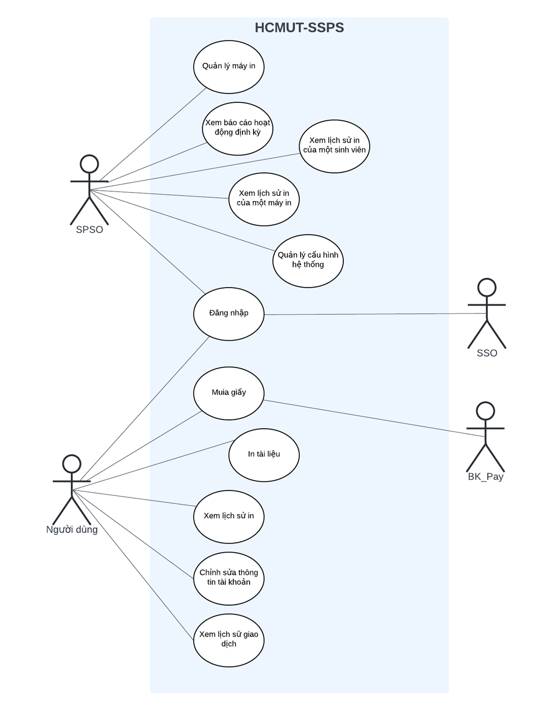
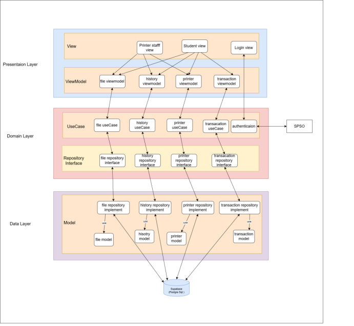
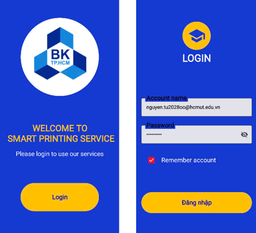
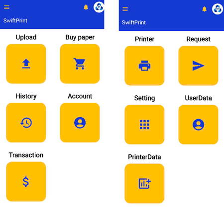
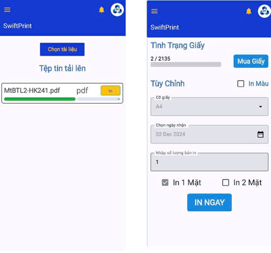
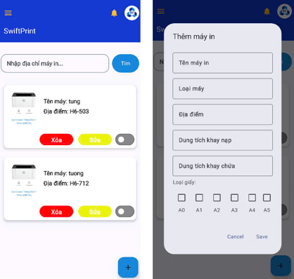
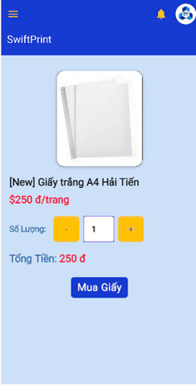
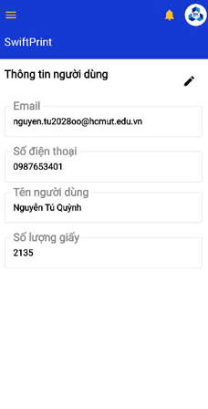
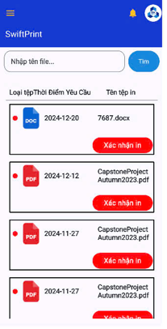
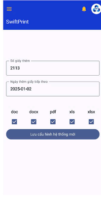

# HCMUT-SSPS: Hệ Thống Dịch Vụ In Ấn Cho Sinh Viên
<p align="center">
  
</p>


## I. REQUIREMENT ELICITATION
### 1. Bối cảnh
Trong thời đại ngày nay, giáo dục là quốc sách hàng đầu để thúc đẩy sự phát triển của đất nước. Việc học tập hiệu quả không thể thiếu các tài liệu học tập, đặc biệt đối với học sinh và sinh viên. Tuy nhiên, việc in ấn tài liệu hiện nay đang gặp nhiều khó khăn, gây bất tiện cho sinh viên.

### 2. Vấn đề hiện tại
- Sinh viên không biết các địa điểm in ấn trong trường, thường phải di chuyển xa để tìm nơi in.
- Thông tin cá nhân và tài liệu in không được bảo mật, gây lo ngại về quyền riêng tư.
- Thời gian chờ đợi lâu do các cửa hàng bên ngoài phải phục vụ nhiều khách hàng.
- Quản lý tài liệu in qua các ứng dụng không chuyên dụng như Messenger, Zalo không hiệu quả, dễ xảy ra lỗi file.
- Chi phí in ấn không được công khai, dễ dẫn đến vượt chi phí dự kiến.
- Các cơ sở in ấn có thể điều chỉnh file in không đúng với mong muốn của người dùng.
- Quản lý in ấn không hiệu quả, khó kiểm soát máy in và số lượng in.

### 3. Giải pháp: HCMUT-SSPS
Phần mềm **HCMUT-SSPS** (HCMUT Smart Student Printing Service) được thiết kế dành riêng cho sinh viên Trường Đại học Bách Khoa TP.HCM, nhằm giải quyết những vấn đề trên một cách hiệu quả:

- **Địa điểm thuận tiện:** Hiển thị các địa điểm máy in trên hệ thống để sinh viên dễ dàng tìm kiếm.
- **Bảo mật cao:** Xác thực qua hệ thống SSO trước khi sử dụng, bảo mật thông tin cá nhân và tài liệu in.
- **Tùy chọn linh hoạt:** Sinh viên có thể in trực tiếp tại máy hoặc đặt lịch nhận tài liệu.
- **Dịch vụ ưu tiên sinh viên:** Chỉ phục vụ sinh viên trong trường, giảm thời gian chờ đợi.
- **Quản lý tài liệu chính xác:** Tải lên hệ thống với tính năng chống lỗi file, điều chỉnh thuộc tính in theo yêu cầu.
- **Chi phí minh bạch:** Hiển thị rõ ràng số tiền thanh toán trên hệ thống, đồng thời hỗ trợ quản lý chi phí qua lịch sử giao dịch.
- **Hiệu quả quản lý:** Hỗ trợ bên quản lý in ấn thống kê, kiểm soát và sử dụng máy in hiệu quả hơn.

### 4. Lợi ích
HCMUT-SSPS mang lại các lợi ích sau:
- Giảm thiểu sự bất tiện trong việc tìm nơi in ấn.
- Đảm bảo an toàn và bảo mật cho thông tin cá nhân và tài liệu.
- Tăng hiệu quả thời gian, tránh tình trạng chờ đợi lâu.
- Cải thiện trải nghiệm người dùng với giao diện trực quan và minh bạch.
- Tăng tính chuyên nghiệp và hiệu quả quản lý in ấn.

---

### 5. Các bên liên quan
#### 1. Khách hàng (Sinh viên và Giảng viên)
- **Nhu cầu:**
  - In tài liệu một cách nhanh chóng và dễ dàng, không cần phải xếp hàng dài chờ đợi.
  - Theo dõi lịch sử in ấn để quản lý chi phí hiệu quả.
  - In tài liệu từ bất kỳ máy in nào trong khuôn viên trường, tiện lợi và linh hoạt.
  - Đảm bảo tính bảo mật của thông tin cá nhân và tài liệu in.

#### 2. Cán bộ Quản lý Dịch vụ In ấn Sinh viên (SPSO)
- **Nhu cầu:**
  - Giám sát và quản lý máy in dễ dàng.
  - Quản lý các cài đặt hệ thống một cách tiện lợi và hiệu quả.
  - Tạo báo cáo về việc sử dụng in ấn và chi phí để hỗ trợ ra quyết định chiến lược.

#### 3. Đơn vị xác thực HCMUT-SSO (Hệ thống xác thực sinh viên Bách Khoa)
- **Nhu cầu:**
  - Quản lý thông tin xác thực của người dùng.
  - Đảm bảo quyền lợi và bảo mật thông tin cá nhân cho sinh viên và giảng viên.

#### 4. Đơn vị quản lý thanh toán BKPay
- **Nhu cầu:**
  - Thống kê và tính toán hóa đơn in ấn nhanh chóng, dễ dàng.
  - Đảm bảo các giao dịch tài chính minh bạch và chính xác.

---

## Key Features for Stakeholders
### **Dành cho khách hàng (Sinh viên/Giảng viên):**
- Đăng nhập an toàn qua hệ thống **HCMUT-SSO**.
- Lựa chọn máy in gần nhất trong khuôn viên trường qua bản đồ hiển thị.
- Điều chỉnh thông số in trực tiếp trên hệ thống.
- Xem lịch sử in ấn và chi phí mọi lúc.

### **Dành cho SPSO:**
- Giao diện quản lý đơn giản, trực quan.
- Quản lý hiệu suất máy in và số lượng tài liệu in.
- Xuất báo cáo định kỳ để hỗ trợ ra quyết định.

### **Dành cho HCMUT-SSO:**
- Xác thực danh tính người dùng trước khi sử dụng dịch vụ in ấn.
- Bảo vệ quyền truy cập và thông tin cá nhân của sinh viên/giảng viên.

### **Dành cho BKPay:**
- Quản lý giao dịch tài chính nhanh chóng.
- Hiển thị thông tin chi phí rõ ràng cho người dùng.

---

## II. Features (Tính năng chính)


---

## III. Architecture Design (Kiến trúc hệ thống)


---

## IV. Installation Guide
## IV. Installation Guide
*(Mục này sẽ hướng dẫn cách cài đặt và sử dụng phần mềm.)*

---

### 1. Xuất file APK và chia sẻ
Bạn có thể build ứng dụng thành file `.apk` và cài đặt trực tiếp trên thiết bị Android.

#### Cách thực hiện:
1. **Xuất file APK từ Android Studio**:
   - Mở Android Studio.
   - Vào menu **Build > Build Bundle(s)/APK(s) > Build APK(s)**.
   - File APK sẽ được lưu tại thư mục `app/build/outputs/apk`.

2. **Chuyển file APK sang thiết bị**:
   - Sử dụng Bluetooth, Google Drive, hoặc chia sẻ qua email để gửi file APK sang điện thoại.

3. **Cài đặt trên thiết bị Android**:
   - Trên điện thoại, vào **Cài đặt > Bảo mật** và bật **Cho phép cài đặt từ nguồn không xác định**.
   - Mở file APK trên điện thoại để cài đặt.

---

### 2. Sử dụng Wi-Fi (ADB không dây)
Bạn có thể sử dụng ADB (Android Debug Bridge) không dây để cài đặt ứng dụng trên điện thoại mà không cần cắm dây.

#### Cách thực hiện:
1. **Kết nối qua Wi-Fi**:
   - Kết nối điện thoại và máy tính vào cùng một mạng Wi-Fi.
   - Cắm dây một lần để kích hoạt ADB không dây:
     ```bash
     adb tcpip 5555
     adb connect <IP_ADDRESS_OF_DEVICE>:5555
     ```
   - (Thay `<IP_ADDRESS_OF_DEVICE>` bằng địa chỉ IP của điện thoại. Bạn có thể tìm địa chỉ IP trong **Cài đặt > Wi-Fi**.)

2. **Cài đặt file APK qua ADB**:
   - Sau khi kết nối ADB không dây, bạn có thể dùng lệnh sau để cài đặt file APK:
     ```bash
     adb install <path_to_apk_file>
     ```

---

### 3. Dùng ứng dụng chia sẻ file APK
Một số ứng dụng trên Google Play cho phép bạn chia sẻ và cài đặt file APK mà không cần qua máy tính. Ví dụ:
   - **APK Installer**
   - **Easy Share**  
   - **Send Anywhere**

#### Cách thực hiện:
1. Build file APK và lưu trên điện thoại.
2. Mở ứng dụng chia sẻ file APK.
3. Chọn gửi file APK tới thiết bị khác qua Bluetooth, Wi-Fi Direct, hoặc mã QR.

---

### 4. Tải ứng dụng trực tiếp qua máy chủ nội bộ
Nếu bạn có máy chủ nội bộ (như XAMPP hoặc Python HTTP Server), bạn có thể:
1. **Đưa file APK lên máy chủ nội bộ**.
2. **Truy cập máy chủ từ điện thoại** qua trình duyệt (nhập địa chỉ IP của máy chủ).
3. Tải và cài đặt file APK.

---

### 5. Sử dụng công cụ quản lý thiết bị
Nếu bạn đang quản lý nhiều thiết bị, các công cụ như **Scrcpy** hoặc **Vysor** cho phép kết nối và cài đặt ứng dụng dễ dàng mà không cần dây cáp.

---


## V. Contact
- **Email:** tung.bui2004lk@hcmut.edu.vn

---

## Screenshot
<p align="center" style="display: grid; grid-template-columns: repeat(2, 1fr);">
  
  
  
  
  
  
  
  
</p>


